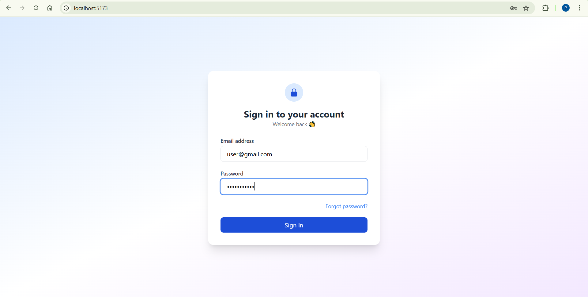
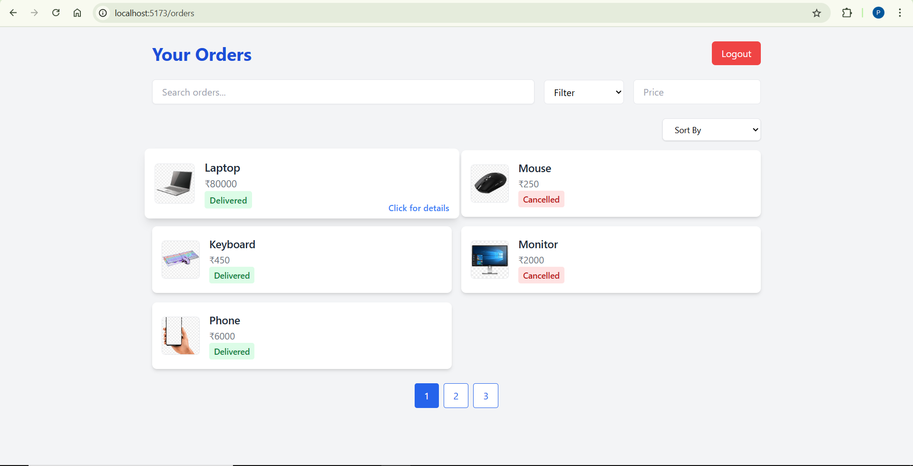
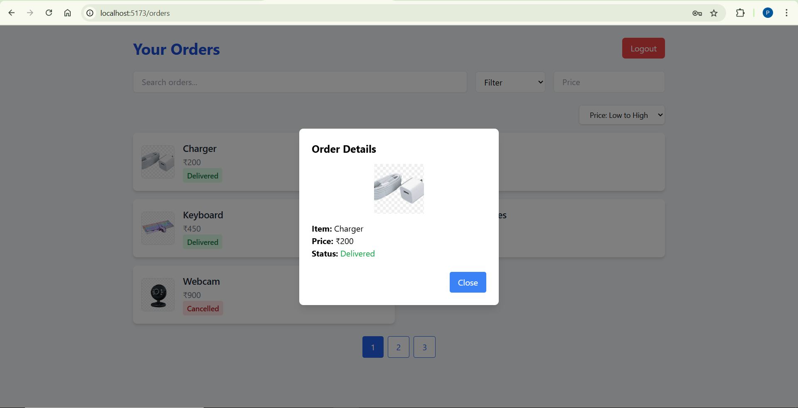
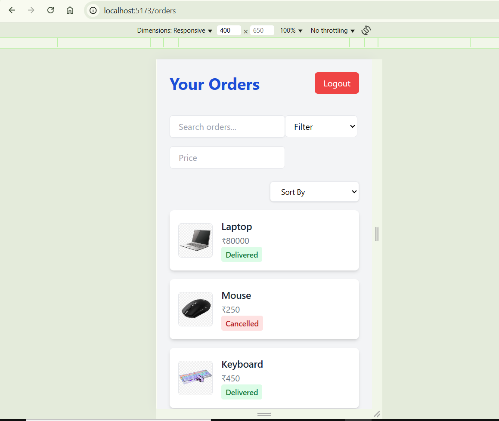

# 🛒 Login+Orders Page 

A fully responsive web application to browse and manage orders — built with React.js, Tailwind CSS, and a mock backend using Node.js + Express.

---

## 🌐 Live Demo

Access the live frontend here:  
👉 [https://loginorderspage.web.app](https://loginorderspage.web.app)

---

## 📸 UI Walkthrough

- **Login Page**  
  → Enter mock email (`user@gmail.com`) and password (`Password123`)  
  → Navigates to orders page on success

- **Orders Page**  
  ✔️ Search orders by product name  
  ✔️ Filter orders by price  
  ✔️ Sort orders by name or price  
  ✔️ Responsive grid layout with hover effects  
  ✔️ Click on a card to see order details in a modal  
---
## 📸 Screenshots

### Login View

### 🖥️ Desktop View

### 🧾 Order Details Modal

### 📱 Responsive View

---

## 🛠️ Tech Stack

| Part         | Technology               |
|--------------|---------------------------|
| Frontend     | React.js + Tailwind CSS   |
| Backend      | Node.js + Express (mock backend) |
| Deployment   | Firebase Hosting (frontend) |
| Tools        | Vite (React build tool)   |

---

## 📁 Project Structure
orders-ui/
│
├── public/
├── src/
│ ├── components/ # Reusable UI components
│ ├── App.jsx
│ ├── main.jsx
│
├── functions/ # Firebase Functions folder (mock-backend)
│ └── index.js # Express server for API
│
├── dist/ # Production build (auto-generated)
├── firebase.json # Firebase config
├── .firebaserc
├── vite.config.js
└── package.json

---

## ⚙️ Local Setup Instructions

### 1. Clone the Project

git clone https://github.com/yourusername/orders-ui.git
cd orders-ui

---
Install Frontend Dependencies : npm install
Run the App Locally: npm run dev
Frontend runs at: http://localhost:5173

---
Install Backend Dependencies (cd functions) : npm install express cors
Run Mock-Backend : node index.js
Backend runs at : http://localhost:5000

---
📤 Firebase Deployment
🛠️ Build the Frontend

npm run build

🔥 Deploy Frontend Only

firebase init hosting

firebase deploy

---

🧾 License
This project is for learning purposes. Feel free to fork, modify, and experiment!

